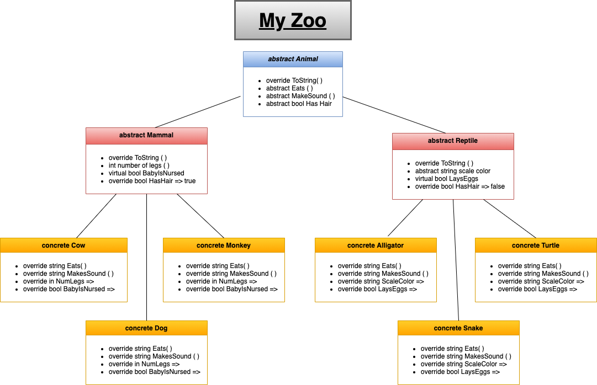
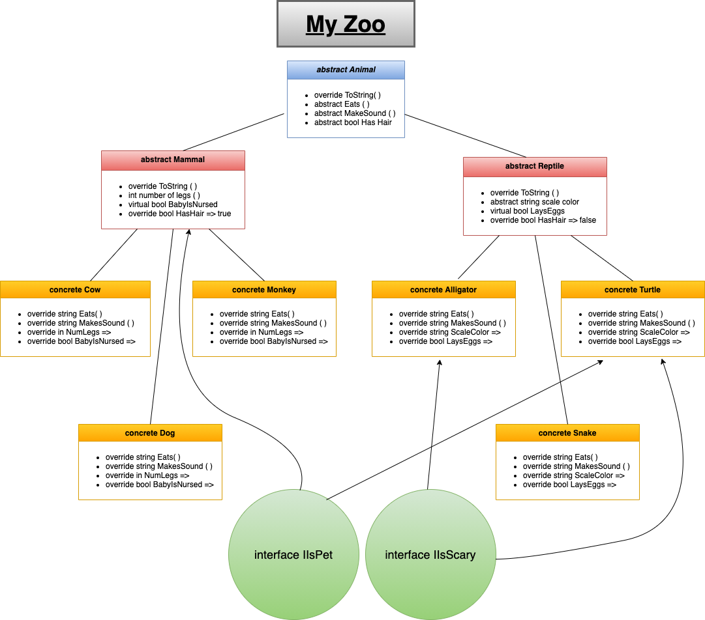

# My Zoo Console Application

## My Zoo

Lab06/07 - OOP Principles

*Author: Ian Whitmore*

----

## Description

A zoo contains animals, and animals can come in many different shapes and sizes. I have built out a console application using OOP Principles to show what animals live in my zoo!

---

### Getting Started
Clone this repository to your local machine.

```
$ git clone [https://github.com/iwhitmor/my-zoo.git]
```

### To run the program from Visual Studio:
Select ```File``` -> ```Open``` -> ```Project/Solution```

Next navigate to the location you cloned the Repository.

Double click on the ```my-zoo``` directory.

Then select and open ```my-zoo.sln```

---

### Visuals

Visuals of application are coming soon!

* Lab 06



* Lab 07

